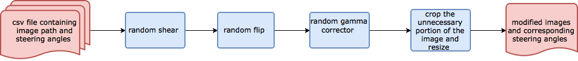

#**Behavioral Cloning** 

##Writeup Template

---
Overview
---
This repository contains files for the Behavioral Cloning Project.

In this project, I have used what I've learned about deep neural networks and convolutional neural networks to clone driving behavior. I have trained, validated and tested a model using Keras. The model would output a steering angle to an autonomous vehicle.

I have used a simulator provided by Udacity where I could steer a car around a track and collect the data. I used image data and steering angles to train a neural network and then use this model to drive the car autonomously around the track.

**Behavioral Cloning Project**

The goals / steps of this project are the following:
* Use the simulator to collect data of good driving behavior
* Preprocess the data for feeding the model
* Build, a convolution neural network in Keras that predicts steering angles from preprocessed images
* Train and validate the model with a training and validation set
* Test that the model successfully drives around track one without leaving the road
* Summarize the results with a written report


[//]: # (Image References)
 
[image1]: ./documentation/behavioral-cloning-pipeline.png "Model Visualization"
[image2]: ./examples/placeholder.png "Grayscaling"
[image3]: ./documentation/gamma.png "Gamma Corrected"
[image4]: ./documentation/shear.png "Random Shear"
[image5]: ./documentation/left-center-right.png "left-center-right"
[image6]: ./documentation/augmented.png "Augmented Image"
[image7]: ./documentation/flip.png "Flipped Image"

## Rubric Points
###Here I will consider the [rubric points](https://review.udacity.com/#!/rubrics/432/view) individually and describe how I addressed each point in my implementation.  

---
###Files Submitted & Code Quality
#### 0. Image Data Preprocessing Pipleline


####1. Submission includes all required files and can be used to run the simulator in autonomous mode

My project includes the following files:
* model.py containing the script to create and train the model
* drive.py for driving the car in autonomous mode
* model.h5 containing a trained convolution neural network 
* writeup_report.md summarizing the results

####2. Submission includes functional code
Using the Udacity provided simulator and my drive.py file, the car can be driven autonomously around the track by executing 
```sh
python drive.py model.json

or 

python drive.py model.h5
```


####3. Submission code is usable and readable

The model.py file contains the code for training and saving the convolution neural network. The file shows the pipeline I used for training and validating the model, and it contains comments to explain how the code works.

###Model Architecture and Training Strategy

####1. An appropriate model architecture has been employed

My convolutional neural network architecture was inspired by NVIDIA's End to End Learning for Self-Driving Cars [paper](https://arxiv.org/pdf/1604.07316v1.pdf). Starting from this base model, I refer to various papers and made trial and error several times, finally making the following architecture.

| Layer (type)                              | Output Shape       | Param # |
|-------------------------------------------|--------------------|---------|
| lambda_1 (Lambda)                         | (None, 64, 64, 3)  | 0       |
| convolution2d_1 (Convolution2D)           | (None, 30, 30, 24) | 1824    |
| prelu_1 (PReLU)                           | (None, 30, 30, 24) | 21600   |
| batchnormalization_1 (BatchNormalization) | (None, 30, 30, 24) | 48      |
| convolution2d_2 (Convolution2D)           | (None, 13, 13, 36) | 21636   |
| prelu_2 (PReLU)                           | (None, 13, 13, 36) | 6084    |
| batchnormalization_2 (BatchNormalization) | (None, 13, 13, 36) | 72      |
| convolution2d_3 (Convolution2D)           | (None, 5, 5, 48)   | 43248   |
| prelu_3 (PReLU)                           | (None, 5, 5, 48)   | 1200    |
| batchnormalization_3 (BatchNormalization) | (None, 5, 5, 48)   | 96      |
| convolution2d_4 (Convolution2D)           | (None, 5, 5, 64)   | 27712   |
| prelu_4 (PReLU)                           | (None, 5, 5, 64)   | 1600    |
| batchnormalization_4 (BatchNormalization) | (None, 5, 5, 64)   | 128     |
| maxpooling2d_1 (MaxPooling2D)             | (None, 4, 4, 64)   | 0       |
| convolution2d_5 (Convolution2D)           | (None, 4, 4, 64)   | 36928   |
| prelu_5 (PReLU)                           | (None, 4, 4, 64)   | 1024    |
| batchnormalization_5 (BatchNormalization) | (None, 4, 4, 64)   | 128     |
| maxpooling2d_2 (MaxPooling2D)             | (None, 3, 3, 64)   | 0       |
| flatten_1 (Flatten)                       | (None, 576)        | 0       |
| dense_1 (Dense)                           | (None, 1164)       | 671628  |
| prelu_6 (PReLU)                           | (None, 1164)       | 1164    |
| batchnormalization_6 (BatchNormalization) | (None, 1164)       | 2328    |
| dropout_1 (Dropout)                       | (None, 1164)       | 0       |
| dense_2 (Dense)                           | (None, 100)        | 116500  |
| prelu_7 (PReLU)                           | (None, 100)        | 100     |
| batchnormalization_7 (BatchNormalization) | (None, 100)        | 200     |
| dropout_2 (Dropout)                       | (None, 100)        | 0       |
| dense_3 (Dense)                           | (None, 50)         | 5050    |
| prelu_8 (PReLU)                           | (None, 50)         | 50      |
| batchnormalization_8 (BatchNormalization) | (None, 50)         | 100     |
| dense_4 (Dense)                           | (None, 10)         | 510     |
| prelu_9 (PReLU)                           | (None, 10)         | 10      |
| batchnormalization_9 (BatchNormalization) | (None, 10)         | 20      |
| dense_5 (Dense)                           | (None, 1)          | 11      |

####2. Attempts to reduce overfitting in the model

The model contains dropout layers in order to reduce overfitting (model.py lines 21). 

The model was trained and validated on different data sets to ensure that the model was not overfitting (code line 10-16). The model was tested by running it through the simulator and ensuring that the vehicle could stay on the track.

####3. Model parameter tuning

The model used an adam optimizer, so the learning rate was not tuned manually (model.py line 25).

####4. Appropriate training data

Training data was chosen to keep the vehicle driving on the road. I used a combination of center lane driving, recovering from the left and right sides of the road ... 

For details about how I created the training data, see the next section. 

###Model Architecture and Training Strategy

####1. Solution Design Approach

The overall strategy for deriving a model architecture was to ...

My first step was to use a convolution neural network model similar to the ... I thought this model might be appropriate because ...

In order to gauge how well the model was working, I split my image and steering angle data into a training and validation set. I found that my first model had a low mean squared error on the training set but a high mean squared error on the validation set. This implied that the model was overfitting. 

To combat the overfitting, I modified the model so that ...

Then I ... 

The final step was to run the simulator to see how well the car was driving around track one. There were a few spots where the vehicle fell off the track... to improve the driving behavior in these cases, I ....

At the end of the process, the vehicle is able to drive autonomously around the track without leaving the road.

####2. Final Model Architecture

The final model architecture (model.py lines 18-24) consisted of a convolution neural network with the following layers and layer sizes ...

Here is a visualization of the architecture (note: visualizing the architecture is optional according to the project rubric)

![alt text][image1]

####3. Creation of the Training Set & Training Process

To capture good driving behavior, I first recorded two laps on track one using center lane driving. Here is an example image of center lane driving:

![alt text][image2]

I then recorded the vehicle recovering from the left side and right sides of the road back to center so that the vehicle would learn to .... These images show what a recovery looks like starting from ... :

![alt text][image3]
![alt text][image4]
![alt text][image5]

Then I repeated this process on track two in order to get more data points.

To augment the data sat, I also flipped images and angles thinking that this would ... For example, here is an image that has then been flipped:

![alt text][image6]
![alt text][image7]

Etc ....

After the collection process, I had X number of data points. I then preprocessed this data by ...


I finally randomly shuffled the data set and put Y% of the data into a validation set. 

I used this training data for training the model. The validation set helped determine if the model was over or under fitting. The ideal number of epochs was Z as evidenced by ... I used an adam optimizer so that manually training the learning rate wasn't necessary.
